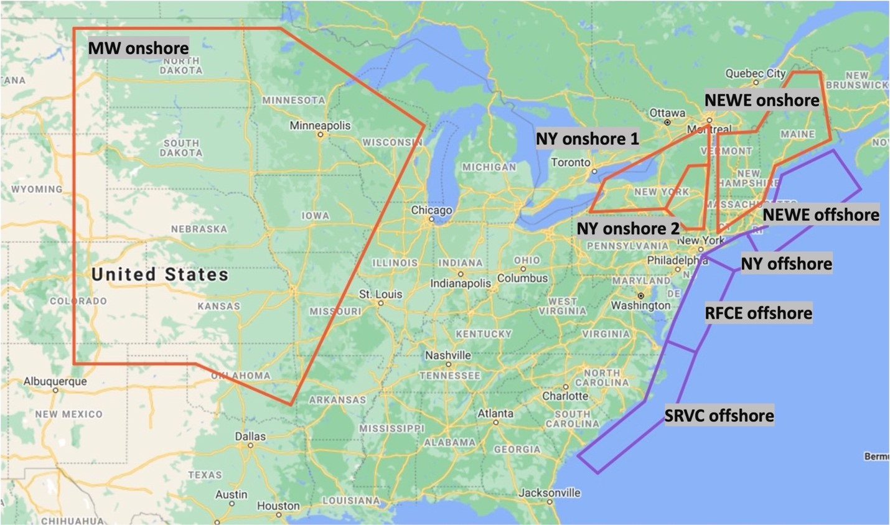

### 
*Final Project Proposal*

##### 
***Yixuan Zou, yz3909***

##### Hypothesis: 
By combining the wind resource in multiple locations will generate more stable power.

This project aims to analysis the effect of combining the diversity of wind time series across different wind resource regions and to answer the question whether more stable power can be produced when we connect regions. Analysis will be done using one year hourly capacity factor data of eight sites (shown in the Fig1), which indicates the wind potential. New York State hourly solar potential data and hourly electricity load data in 2011 will be used to analyse the possibility of fulfilling electricity load with renewable energy (wind and solar).

##### Dataset: [wind_po_hr.csv ](https://zenodo.org/record/5739406#.YabNWNCZPZs)

##### Dataset: [solar_potential ](https://zenodo.org/record/5750726#.YalDatCZPZs)

##### Dataset: [electricity_load](https://zenodo.org/record/5750734#.YalDsdCZPZs)

<ol>
<li> NY1 (NY_1 onshore; column B in csv file)</li>
<li> NY2 (NY_2 onshore; column C in csv file)</li>
<li> New England (NEWE onshore; column D in csv file)</li>
<li> Midwest (MW onshore; column E in csv file)</li>
<li> OSW1 (NEWE offshore; column F in csv file)</li>
<li> OSW2 (NY offshore; column G in csv file)</li>
<li> OSW3 (RFCE offshore; column H in csv file)</li>
<li> OSW4 (SRVC offshore; column I in csv file)</li>
</ol>

##### Plan to do
- Investigate the seasonal wind energy trend in 8 sites and combination 
- Investigate the diurnal energy trend in 8 sites and combination
- Investigate whether the renewable energy availability (solar and wind) in upper New York state can meet the requirement of local electricity load, if not, what is the energy gap between generation and load